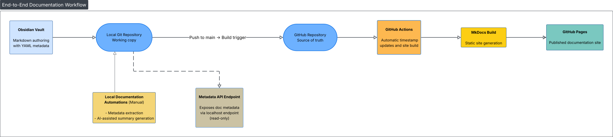

## 1. Introduction

### 1.1 Purpose of the Document

This document provides a high-level overview of the documentation system, outlining its components, structure, and how content moves from authoring to publication.

The goal is to support onboarding and future development by clarifying how Obsidian, Git, MkDocs, GitHub Pages, and GitHub Actions interact within the larger documentation workflow. By describing these connections explicitly, the document offers a stable reference for maintaining, extending, or modifying the system over time.

### 1.2 Previous Knowledge Assumptions

Readers do not need a deep technical background to understand this document. References to Git, static site generators, and CI/CD pipelines are kept at a conceptual level, so those new to these tools can still follow the architectural overview.

For contributors who plan to modify or extend the system, a basic familiarity with Markdown and Git will eventually be required.

### 1.3 System Overview

Manual documentation approaches become difficult to maintain and share as complexity grows. This system establishes a structured, extensible baseline that supports automation, consistency, and collaborative evolution over time.

At a high level, this is a doc-as-code documentation system that combines an Obsidian authoring vault, a Git/GitHub repository, MkDocs Material, and a GitHub Actions pipeline.

Content is used to build and deploy a public documentation site to GitHub Pages on each push to the main branch.

### 1.4 System at a Glance

- **Source of truth:** GitHub repository mirroring the local Obsidian vault
- **Authoring tool:** Obsidian vault with structured folders, templates with YAML frontmatter
- **Automation scripts:** Python-based tools handling indexing, AI-generated summaries, and frontmatter timestamp updates
- **CI/CD pipeline:** GitHub Actions workflow that builds and deploys the site to GitHub Pages on every push to main

---

## 2. System Components

### 2.1 Obsidian Vault

The local directory of Markdown files used as the primary authoring environment. Writers create and edit Markdown files using templates with YAML frontmatter, ensuring that each document carries consistent metadata required by downstream scripts and CI pipelines.

The vault corresponds directly to the working directory of the Git repository.

### 2.2 Git and GitHub Repository

The GitHub repository stores the system's documentation, configuration files, and automation code. It provides the shared remote location from which automation and publishing processes operate.

### 2.3 MkDocs and Site Generation

MkDocs is a static site generator for building documentation websites from Markdown files. In this system, it generates the documentation site published via GitHub Pages.

### 2.4 GitHub Actions and CI

GitHub Actions is GitHub's built-in automation and continuous integration service. In this system, it executes automated tasks in response to changes in the repository — including site builds and timestamp updates.

### 2.5 Automation Scripts

Custom Python scripts maintained as part of the system to perform operations on documentation files and metadata. They are executed either locally (indexing, summaries) or within CI (timestamp updates).

---

## 3. Workflows

This section provides a brief overview of the system's automated workflows. For detailed usage instructions, see the individual workflow documents.

### 3.1 Site Publication

**Trigger:** A commit is pushed to the main branch.

**Outcome:** The documentation site is rebuilt and redeployed to GitHub Pages, reflecting the current repository state.

### 3.2 Timestamp Maintenance

**Trigger:** A push to main (without `[skip-timestamp]` flag).

**Outcome:** The `updated:` field in changed Markdown files is automatically updated by CI.

See: [Timestamp Maintenance](../workflows/Timestamp%20Maintenance.md)

### 3.3 Index Generation

**Trigger:** Manual execution of `metadata_extractor.py`.

**Outcome:** Generates `auto-index.md` — a navigable index of all documentation files with their metadata.

See: [Index Generation](../workflows/Index%20Generation.md)

### 3.4 AI Summary Generation

**Trigger:** Manual execution of `chatgpt_summary.py` on a Markdown file.

**Outcome:** Generates a standardised summary file with propagated metadata.

See: [AI Summary Generation](../workflows/AI%20Summary%20Generation.md)

---

## 4. Visual Overview

The diagram below shows how the system components connect, from local authoring to published documentation.

**Main pipeline (solid arrows, thick):** Content flows from left to right—authored locally in Obsidian, tracked in Git, pushed to GitHub, processed by GitHub Actions, built with MkDocs, and published to GitHub Pages.

**Local Documentation Automations (solid line):** Metadata extraction and AI-assisted summary generation connect to the local Git repository. These run manually before commits.

**Metadata API Endpoint (dashed line):** A read-only local endpoint that exposes document metadata. Operates independently from the publishing pipeline.

**Colour key:**
- **Green:** Content creation (Obsidian Vault)
- **Blue:** Version control and storage (Local Git Repository, GitHub Repository)
- **Orange:** Cloud automation (GitHub Actions)
- **Yellow:** Build and local tools (MkDocs Build, Local Documentation Automations)
- **Light blue:** Read-only utility (Metadata API Endpoint)
- **Teal:** Published output (GitHub Pages)